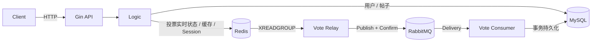
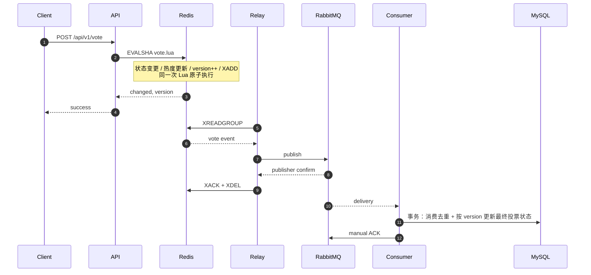

# convo

> 基于 Go / Gin 的社区论坛后端。项目重点围绕投票写链路，处理并发状态更新、异步持久化、重复与乱序消息，以及 Redis 状态恢复。

[](https://go.dev)
[](LICENSE)
[](https://github.com/scut2024hjt/convo/actions/workflows/ci.yml)

项目提供用户注册登录、帖子发布与查询、投票、按时间或热度分页等基础论坛功能。投票链路采用 **Redis 实时状态 + Redis Stream Outbox + RabbitMQ 异步持久化 + MySQL 最终状态** 的设计：HTTP 请求不同步等待 MySQL 写入，同时通过消费幂等、事件版本控制、重试与死信处理异步链路中的重复、乱序和失败场景。

Redis 中与投票相关的状态被视为**可重建的派生状态**；当 Redis 状态丢失或不完整时，项目通过显式维护流程从 MySQL 重建，而不是在在线状态下直接覆盖 Redis。

## 核心设计

| 关注点 | 设计 |
|---|---|
| **投票原子性** | Redis Lua 在一次执行中完成投票状态变更、帖子热度更新、事件版本递增和持久化事件生成 |
| **写链路解耦** | 投票请求在 Redis 更新成功后返回；后台 Relay 将 Stream 事件投递至 RabbitMQ，再由 Consumer 持久化至 MySQL |
| **可靠消息处理** | Publisher Confirm、手动 ACK、失败重试与死信队列；Relay 可接管 Stream 中遗留的 pending 消息 |
| **重复与乱序** | Consumer 通过 `event_id` 实现消费幂等，并通过单调 `version` 防止旧事件覆盖新状态 |
| **缓存一致性** | 帖子详情采用 Cache-Aside，更新数据库后删除缓存并执行延迟二次删除 |
| **Redis 恢复** | 投票状态、热度与帖子索引作为派生状态，可在维护窗口内从 MySQL 分批重建 |
| **多实例运行** | Snowflake `machine_id` 可配置；登录态保存在 Redis；限流 member 使用随机 nonce 避免跨实例同毫秒碰撞 |

## 架构



### 投票写链路



投票接口返回成功表示：**Redis 中的实时状态与对应持久化事件已经原子提交**；并不表示 MySQL 已完成持久化。

异步链路按**至少一次投递**处理，因此允许重复消息出现，但要求同一事件被重复消费时不会重复改变最终业务状态。

## 投票一致性设计

### 1. Redis Lua：把一次投票变成一个原子状态转换

一次投票可能是首次投票、改票、取消投票或同方向重复提交，同时会影响：

- 用户对帖子的投票方向；
- 帖子热度；
- 事件版本；
- 后续需要持久化的事件。

这些修改由同一段 `vote.lua` 完成，避免并发请求下只更新部分状态。

### 2. Redis Stream Outbox：关闭 Redis 与 MQ 之间的丢事件窗口

如果应用先修改 Redis，再单独发布 RabbitMQ 消息，会存在：

```text
Redis 更新成功
    ↓
进程退出
    ↓
RabbitMQ 消息尚未发布
```

此时实时状态已经改变，但缺少后续持久化事件。

项目将 Stream 事件写入与业务状态修改放入同一次 Lua 执行：

```text
Lua 原子执行
├─ 更新投票状态
├─ 更新帖子热度
├─ version++
└─ XADD 持久化事件
        ↓
      Relay
        ↓
 RabbitMQ Publish
        ↓
 Publisher Confirm
        ↓
   XACK + XDEL
```

Relay 只有收到 RabbitMQ 发布确认后才确认并删除 Stream 记录；遗留的 pending 消息可由其他 Relay 接管。

### 3. 消费幂等与事件版本：处理重复和乱序

系统不依赖“消息只会消费一次”的假设。

Consumer 在 MySQL 事务中：

1. 按 `event_id` 登记消费记录，使同一事件重复到达时不会重复生效；
2. 为 `(user_id, post_id)` 保存单调递增的 `version`；
3. 只有事件版本高于已持久化版本时，才更新最终投票方向。

因此，即使 `v3` 先于 `v2` 到达，后到的旧事件也不会覆盖新状态。

> 这里实现的是**最终一致 + 至少一次投递下的幂等处理**，不宣称 Exactly Once 或分布式强一致。

## Redis 状态恢复

Redis 保存实时投票状态、热度和帖子索引等派生数据；MySQL 保存帖子及最终投票状态。

由于正常路径是 Redis 先更新、MySQL 后异步持久化，Redis 在正常运行时可能合法领先于 MySQL。因此恢复不是在线直接“拿 MySQL 覆盖 Redis”，而是在维护窗口内先排空异步链路：

```text
停止新增写入
    ↓
排空 Outbox / RabbitMQ
    ↓
停止应用实例
    ↓
标记 rebuilding
    ↓
从 MySQL 分批重建 Redis
    ↓
完整性检查通过
    ↓
恢复服务
```

重建内容包括：

- 帖子时间索引与社区索引；
- 帖子热度；
- 用户投票方向；
- 每个用户-帖子的最高事件版本。

取消投票后虽然无需恢复对应投票方向，但最高版本仍需保留，避免重建后版本回退导致新事件被数据库判断为旧消息。

应用启动时会检查恢复状态与关键索引完整性；检测到 Redis 状态不完整时，不继续提供依赖这些状态的业务服务。

## 缓存与查询

- **帖子详情**：采用 Cache-Aside；数据库更新后删除缓存，并执行延迟二次删除。
- **Redis 异常降级**：帖子详情读取 Redis 失败时回退 MySQL。
- **帖子列表**：批量查询用户与社区信息，避免按帖子逐条查询关联数据。
- **Redis 批量读取**：投票相关状态通过 Pipeline 批量获取，减少网络往返。

延迟双删只用于缩小并发读写下旧值重新进入缓存的窗口，最终仍依赖缓存 TTL 兜底，并不提供严格缓存一致性。

## API

“访问权限”表示接口是否要求登录，不表示功能完成状态。

| Method | Path | Description | 访问权限 |
|---|---|---|---|
| POST | `/api/v1/signup` | 用户注册 | 公开 |
| POST | `/api/v1/login` | 用户登录 | 公开 |
| GET | `/api/v1/community` | 社区列表 | 公开 |
| GET | `/api/v1/community/:id` | 社区详情 | 公开 |
| GET | `/api/v1/post/:id` | 帖子详情 | 公开 |
| GET | `/api/v1/posts` | 基础帖子列表 | 公开 |
| GET | `/api/v1/posts2` | 按时间 / 热度分页 | 公开 |
| POST | `/api/v1/post` | 发布帖子 | 登录后 |
| PUT | `/api/v1/post/:id` | 编辑帖子 | 登录后 |
| POST | `/api/v1/vote` | 投票 / 改票 / 取消投票 | 登录后 |
| POST | `/api/v1/logout` | 注销当前会话 | 登录后 |

Swagger：`http://localhost:9090/swagger/index.html`

## 快速开始

### Docker Compose

```bash
docker compose up -d --build
```

启动后：

| 服务 | 地址 |
|---|---|
| API | `http://localhost:9090` |
| Swagger | `http://localhost:9090/swagger/index.html` |
| pprof | `http://localhost:9090/debug/pprof/` |
| RabbitMQ Management | `http://localhost:15672` |

健康检查：

```bash
curl -s localhost:9090/ping
```

### 本地运行

```bash
# 启动依赖
docker compose up -d redis507 mysql8019 rabbitmq

# 初始化 MySQL
mysql -h127.0.0.1 -P33306 -uroot -p123456 < init.sql

# 启动应用
go run .
```

配置文件位于 `conf/config.yaml`，可通过 `CONVO_` 前缀环境变量覆盖。生产模式下需要显式配置非示例 JWT secret。

## 测试与验证

```bash
# 单元测试
go test ./...

# 集成测试（需要 MySQL / Redis）
go test -tags=integration ./...

# 静态检查
go vet ./...
go vet -tags=integration ./...

# 竞态检测
CGO_ENABLED=1 go test -tags=integration -race ./...
```

`scripts/` 中包含针对主要功能与故障路径的验收脚本：

| Script | Coverage |
|---|---|
| `verify_resume_features.sh` | 注册、登录、帖子、投票、排序等主要接口 |
| `fault_test.sh` | RabbitMQ 暂时不可用及恢复后的补偿落库 |
| `verify_recovery.sh` | Redis 数据丢失、拒绝带病启动、离线重建与版本连续性 |
| `verify_ratelimit.sh` | 多实例并发限流、用户隔离与窗口恢复 |
| `multi_instance_test.sh` | 多实例 ID 与投票行为 |

> `verify_recovery.sh` 会执行 `FLUSHDB`，仅用于测试环境。

## 项目结构

```text
main.go                 应用入口、依赖初始化、worker、启动检查与优雅退出
cmd/rebuild-redis/      Redis 派生状态离线重建命令
router/                 路由与中间件注册
middlewares/            JWT / Redis Session / 投票限流
controller/             HTTP 参数与响应处理
logic/                  业务逻辑与恢复编排
dao/mysql/              MySQL 数据访问、最终投票状态、消费去重
dao/redis/              vote.lua、Stream Outbox、缓存、Session、限流、重建
mq/                     RabbitMQ 拓扑与发布逻辑
worker/                 Stream Relay 与 RabbitMQ Consumer
models/                 数据模型
settings/               配置加载
pkg/                    JWT / bcrypt / Snowflake 等通用组件
scripts/                集成与故障验证脚本
```

## 一致性与故障边界

项目明确采用最终一致语义，不宣称分布式强一致或 Exactly Once。

- 投票成功返回后，MySQL 可能尚未更新；实时状态以 Redis 为准。
- 消息链路可能重复投递，由 Consumer 的幂等逻辑处理。
- Redis 恢复要求进入维护流程并先排空异步链路，不是在线自动对账。
- 发帖仍存在 MySQL → Redis 的跨存储更新，不提供跨存储事务一致性。
- 延迟双删只能降低脏缓存长期存在的概率，不提供严格缓存一致性。
- 投票状态和消费去重记录仍需要后续冷数据治理与归档策略。

## 项目来源

本项目基于已有 Go Web 教程项目进行二次开发。基础项目提供注册、帖子等论坛功能；当前仓库重点扩展了：

- 投票状态机与 Redis Lua 原子写；
- Redis Stream + RabbitMQ 异步持久化；
- 消费幂等与乱序事件处理；
- 帖子缓存一致性与批量查询优化；
- Redis 状态恢复与启动完整性检查；
- Redis Session、多实例 ID、限流及故障验证。

原始版权声明按 MIT License 保留。

## License

MIT
