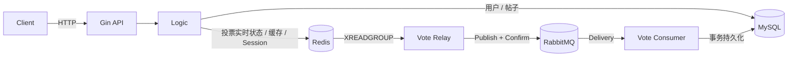

# convo

> 基于 Go / Gin 的社区论坛后端。项目重点围绕投票写链路，处理并发状态更新、异步持久化、重复/乱序消息以及 Redis 状态恢复。

[](https://go.dev)
[](LICENSE)
[](https://github.com/scut2024hjt/convo/actions/workflows/ci.yml)

项目提供用户注册登录、帖子发布与查询、投票、按时间/热度分页等论坛基础功能。在此基础上，投票链路采用 **Redis 实时状态 + Redis Stream Outbox + RabbitMQ 异步落库 + MySQL 权威状态** 的设计：HTTP 请求不等待 MySQL 持久化，同时通过幂等消费、事件版本控制和离线重建明确处理异步链路中的故障与一致性边界。

## 核心设计

| 目标 | 实现 |
|---|---|
| 投票状态原子更新 | Redis Lua 在一次执行中完成投票状态变更、热度更新、事件版本递增和 Outbox 写入 |
| 请求与数据库写入解耦 | 投票请求写 Redis 成功后返回，后台 Relay 将 Outbox 事件投递至 RabbitMQ，再由 Consumer 持久化到 MySQL |
| 重复与乱序处理 | 消费端按 `event_id` 幂等去重，并使用单调 `version` 防止旧事件覆盖新状态 |
| 消息失败处理 | RabbitMQ 发布确认、手动 ACK、重试队列和死信队列；Relay 可接管 Redis Stream 中遗留的 pending 消息 |
| 缓存一致性 | 帖子详情采用 Cache-Aside，更新后删除缓存并执行延迟二次删除 |
| Redis 数据恢复 | Redis 中的投票、热度和帖子索引作为派生状态，可在维护窗口内从 MySQL 分批重建 |
| 多实例运行 | Snowflake `machine_id` 可配置；登录状态保存在 Redis；限流 member 使用随机 nonce 避免跨实例同毫秒碰撞 |

## 架构



### 投票写链路


投票接口返回成功的语义是：**Redis 中的实时状态和 Outbox 事件已经原子提交**；并不表示 MySQL 已完成持久化。后续链路按至少一次投递处理，因此 Consumer 必须能够安全处理重复和乱序事件。

## 为什么需要 Redis Stream Outbox

如果请求先修改 Redis，再由应用进程单独发布 RabbitMQ 消息，会存在一个窗口：Redis 已经成功，但进程在消息发布前退出。此时实时状态已经改变，却没有可继续投递的事件。

本项目将 `XADD` 放入同一段 `vote.lua`：

```text
投票状态变更
+ 热度更新
+ version 递增
+ Outbox 事件写入
        ↓
同一次 Redis Lua 原子执行
```

后台 Relay 再负责把 Stream 事件转发到 RabbitMQ。只有收到发布确认后，才 `XACK` 并删除对应 Stream 记录；实例退出后遗留的 pending 消息可以由其他 Relay 接管。

## 重复和乱序事件

异步链路不依赖“消息只会收到一次”的假设。

Consumer 在 MySQL 事务中完成两件事：

1. 使用 `event_id` 登记消费记录，重复事件不会重复生效；
2. `(user_id, post_id)` 保存单调递增的 `version`，只有更新事件版本更高时才修改最终投票方向。

因此，即使 `v3` 先于 `v2` 到达，后到的旧事件也不会覆盖已经持久化的新状态。

## Redis 状态恢复

Redis 保存的是可重建的派生状态；MySQL 保存帖子和最终投票状态。

由于正常运行时投票先进入 Redis、再异步落库，Redis 可能合法地领先 MySQL，因此项目不在在线状态下直接用 MySQL 覆盖 Redis。恢复采用显式维护流程：

```text
停止新增写入
    ↓
排空 Outbox / RabbitMQ
    ↓
停止应用实例
    ↓
标记 rebuilding
    ↓
从 MySQL 分批重建 Redis
    ↓
完整性检查通过
    ↓
恢复服务
```

重建内容包括帖子索引、热度、用户投票方向和事件版本。取消投票记录虽然不需要重新加入投票 ZSet，但其最高版本仍需恢复，否则后续新事件可能因版本回退而被数据库判定为旧消息。

启动时会检查恢复状态和关键索引完整性；检测到 Redis 状态不完整时，应用拒绝继续提供依赖这些状态的服务。

## 缓存与查询

- 帖子详情：Cache-Aside；数据库更新后删除缓存，并执行延迟二次删除。
- Redis 异常时：详情读取可直接回退 MySQL。
- 帖子列表：批量查询用户/社区信息，减少逐条数据库查询；投票相关状态使用 Redis Pipeline 批量获取。
- 列表并发查询：使用 singleflight 合并相同条件下的并发加载请求。

延迟双删并不是强一致方案；它用于缩小并发读写下旧值重新进入缓存的窗口，最终仍由 TTL 兜底。

## 快速开始

### Docker Compose

```bash
docker compose up -d --build
```

启动后：

| 服务 | 地址 |
|---|---|
| API | `http://localhost:9090` |
| Swagger | `http://localhost:9090/swagger/index.html` |
| pprof | `http://localhost:9090/debug/pprof/` |
| RabbitMQ Management | `http://localhost:15672` |

自检：

```bash
curl -s localhost:9090/ping
```

### 本地运行

```bash
# 启动依赖
docker compose up -d redis507 mysql8019 rabbitmq

# 初始化 MySQL
mysql -h127.0.0.1 -P33306 -uroot -p123456 < init.sql

# 启动应用
go run .
```

配置文件位于 `conf/config.yaml`，可通过 `CONVO_` 前缀环境变量覆盖。生产模式下需要显式配置非示例 JWT secret。

## API

| Method | Path | Description | Auth |
|---|---|---|:---:|
| POST | `/api/v1/signup` | 注册 | |
| POST | `/api/v1/login` | 登录 | |
| POST | `/api/v1/logout` | 注销当前会话 | ✓ |
| GET | `/api/v1/community` | 社区列表 | |
| GET | `/api/v1/community/:id` | 社区详情 | |
| GET | `/api/v1/post/:id` | 帖子详情 | |
| GET | `/api/v1/posts` | 帖子列表 | |
| GET | `/api/v1/posts2` | 按时间/热度分页 | |
| POST | `/api/v1/post` | 发布帖子 | ✓ |
| PUT | `/api/v1/post/:id` | 编辑帖子 | ✓ |
| POST | `/api/v1/vote` | 投票 / 改票 / 取消投票 | ✓ |

## 测试与验证

```bash
# 单元测试
go test ./...

# 集成测试（需要 MySQL / Redis）
go test -tags=integration ./...

# 静态检查
go vet ./...
go vet -tags=integration ./...

# 竞态检测
CGO_ENABLED=1 go test -tags=integration -race ./...
```

`scripts/` 中还包含面向故障场景的验证脚本：

| Script | Coverage |
|---|---|
| `verify_recovery.sh` | Redis 数据丢失、拒绝带病启动、离线重建、版本连续性 |
| `fault_test.sh` | RabbitMQ 暂时不可用与恢复后的补偿落库 |
| `verify_ratelimit.sh` | 多实例并发限流、用户隔离、窗口恢复 |
| `multi_instance_test.sh` | 多实例 ID 与投票行为 |
| `verify_resume_features.sh` | 注册、登录、帖子、投票、排序等主要接口 |

> `verify_recovery.sh` 会执行 `FLUSHDB`，仅用于测试环境。

## 项目结构

```text
main.go                 应用入口、依赖初始化、worker、启动检查与优雅退出
cmd/rebuild-redis/      Redis 派生状态离线重建命令
router/                 路由与中间件注册
middlewares/            JWT / Redis Session / 投票限流
controller/             HTTP 参数与响应处理
logic/                  业务逻辑与恢复编排
dao/mysql/              MySQL 数据访问、最终投票状态、消费去重
dao/redis/              vote.lua、Outbox、缓存、Session、限流、重建
mq/                     RabbitMQ 拓扑与发布逻辑
worker/                 Stream Relay 与 RabbitMQ Consumer
models/                 数据模型
settings/               配置加载
pkg/                    JWT / bcrypt / Snowflake 等通用组件
scripts/                集成与故障验证脚本
```

## 一致性与故障边界

项目明确采用最终一致语义，不宣称分布式强一致或 Exactly Once。

- 投票成功返回后，MySQL 可能暂时尚未更新；实时读以 Redis 状态为准。
- 消息链路按至少一次投递设计，因此可能出现重复投递，依赖 Consumer 幂等处理。
- Redis 恢复要求进入维护流程并先排空异步链路；不是在线自动对账。
- 发帖仍存在 MySQL → Redis 的跨存储更新，不宣称跨存储事务一致性。
- 帖子详情延迟双删只能缩小脏缓存窗口，不提供严格缓存一致性。
- 投票状态和消费去重表需要后续冷数据治理与归档策略。

## 后续计划

- 增加 Prometheus 指标与 Grafana 可视化，补充 MQ 堆积、缓存命中率、限流拒绝等运行指标。
- 为缓存增加随机 TTL / 空值缓存等常规防护，并明确适用边界。
- 完善冷帖子投票状态和消费去重记录的归档策略。
- 补充固定环境下的可复现性能测试；性能数据仅用于同环境方案对比，不作为生产规模声明。

## 项目来源

本项目基于一个开源 Go Web 教程项目进行二次开发。基础项目提供注册、帖子等论坛功能；当前仓库重点扩展了投票状态机、Redis Lua 原子写、Redis Stream Outbox、RabbitMQ 异步持久化、幂等与乱序处理、缓存一致性、Redis 状态恢复、多实例相关机制及故障验证。

原始版权声明按 MIT License 保留。

## License

[MIT](LICENSE)
