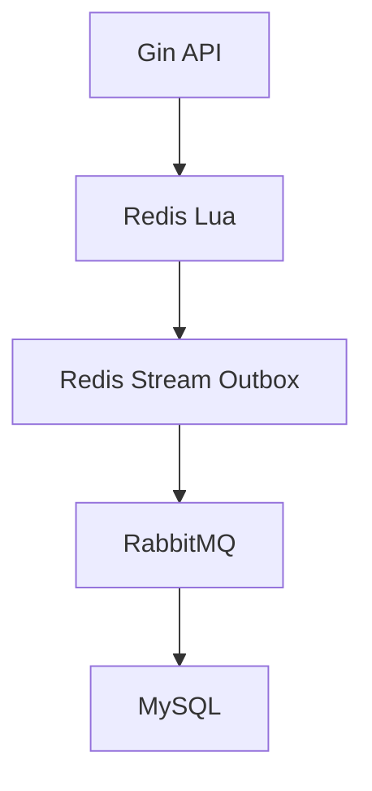
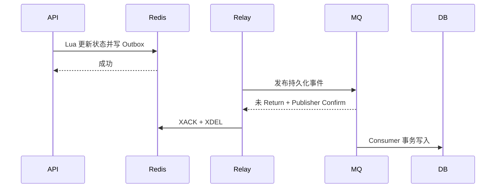

# Convo 社区论坛后端改造设计文档

> 文档状态：核心实施基线（v1.2，已完成范围收敛）  
> 适用代码基线：`3b3c81e`（`main`）  
> 最近更新：2026-09-21  
> 文档目标：约束后续设计、编码、测试和简历表述，避免实现过程中不断堆叠技术或偏离核心故事线。

---

## 1. 文档定位

本项目不是从零重写，也不以“中间件越多越好”为目标。改造应保留当前 Gin、controller/logic/dao 分层、MySQL 帖子数据、Redis ZSet 排序、批量查询和 singleflight 等已有实现，集中补齐以下三条可被代码、测试和故障实验共同证明的主线：

1. **并发投票正确性**：使用 Redis Lua 原子维护投票状态、帖子热度和事件版本。
2. **可靠异步持久化**：使用 Redis Outbox、RabbitMQ 和幂等消费者，将投票最终同步到 MySQL。
3. **缓存与登录态**：实现帖子详情 Cache-Aside、延迟双删，以及 JWT + Redis Session 单设备登录。

本文档是后续实现的约束基线。若实现中需要改变核心语义、数据模型或可靠性边界，应先修改本文档并说明原因，再修改代码。

本文严格区分：

- **核心必做**：直接支撑五条项目描述，必须实现并测试。
- **必要小修**：实现核心功能时顺手修复，不能发展成新的子项目。
- **明确不做**：即使存在改进空间，本轮也只记录边界，不进入施工计划。

---

## 2. 最终项目描述与能力边界

### 2.1 项目描述

基于 Go 开发的社区论坛后端，提供用户注册登录、帖子发布与查询、并发投票及帖子热度排序等功能。

### 2.2 建议在全部验收完成后使用的简历表述

- **并发投票**：使用 Redis Lua 原子维护用户投票状态、帖子热度与事件版本，解决并发改票和重复投票导致的计分竞态。
- **写链路解耦**：通过 Redis Outbox 与 RabbitMQ 解耦投票请求和 MySQL 持久化，使 MQ 临时不可用时投票仍可被记录并在恢复后补发。
- **消息可靠**：采用持久化队列、Publisher Confirm、手动 ACK、版本校验和消费幂等，在至少一次投递下保证业务效果不重复，并实现 Redis 与 MySQL 最终一致。
- **缓存一致性**：使用 Cache-Aside 缓存帖子详情，通过“更新数据库、立即删缓存、延迟再次删除”降低并发读写产生脏缓存的概率。
- **登录态与 ID**：使用 JWT + Redis Session 实现单设备登录与主动退出；通过可配置的 Snowflake 节点号支持多实例独立生成用户、帖子和事件 ID。

### 2.3 不应使用的绝对化表述

以下说法不准确，禁止写入 README、简历或面试回答：

- “RabbitMQ 保证消息绝不丢失、绝不重复。”
- “系统实现了 exactly-once 消息投递。”
- “延迟双删完全保证缓存与数据库强一致。”
- “JWT 本身实现了单设备登录。”
- “只要用了 Snowflake，多实例 ID 就一定不会冲突。”

准确边界是：系统使用**至少一次投递**，允许消息重复，但通过幂等表和业务版本使最终业务效果不重复；缓存策略只降低短暂不一致概率；Snowflake 依赖各实例使用唯一且合法的 `machine_id`。

### 2.4 冻结后的核心实施范围

| 项目描述 | 必须落地的最小实现 |
| --- | --- |
| 并发投票 | Redis Lua 原子更新方向、热度、version 和 Stream 事件 |
| 写链路解耦 | Outbox Relay 把 Stream 事件发布到 RabbitMQ，HTTP 不等待 MySQL |
| 消息可靠 | durable/persistent、mandatory + Confirm、手动 ACK、消费幂等、version 防乱序、有限重试与 DLQ |
| 缓存一致性 | 帖子详情 Cache-Aside、编辑帖子、更新 DB 后立即删除并延迟再删 |
| 登录态与 ID | JWT + Redis Session 单设备登录、logout、可配置 Snowflake machine ID |

后续实现以此表为准。Compose 调整、依赖升级、日志整理等只能服务于这些功能，不得成为新的主线或推迟核心阶段验收。

---

## 3. 当前代码基线审计

### 3.1 已有能力

| 能力 | 当前实现 | 结论 |
| --- | --- | --- |
| HTTP 服务 | Gin，路由、中间件、统一响应 | 保留 |
| 代码分层 | `controller` / `logic` / `dao` | 保留并小幅扩展 |
| 数据库 | MySQL + sqlx | 保留 |
| 排序 | Redis ZSet 保存发帖时间和热度 | 保留 |
| 投票状态 | 每个帖子一个 ZSet，成员为用户、分值为方向 | 数据结构保留 |
| ID | Snowflake 生成用户和帖子 ID | 保留，补多实例配置 |
| 列表查询 | Redis 取 ID、MySQL 批量查询、pipeline、singleflight | 保留 |
| 关停 | HTTP Server 已有超时关停 | 扩展到后台 worker 与 MQ |

### 3.2 与目标不一致的地方

| 问题 | 当前证据 | 风险 |
| --- | --- | --- |
| 投票非原子 | `dao/redis/vote.go` 在事务外先 `ZScore`，再执行 `TxPipeline` | 并发请求读到相同旧值，热度重复累计 |
| 无投票持久化 | `init.sql` 没有 `post_vote` 表 | Redis 丢失后无法恢复，无法证明最终一致 |
| 无 MQ | 配置、依赖、启动流程均不存在 RabbitMQ | 简历中的写链路解耦尚未成立 |
| 无可靠发送 | Redis 更新后没有可恢复的待发送记录 | 若更新成功后进程崩溃，事件永久丢失 |
| 无幂等消费 | 没有消费记录表与版本判断 | 重投可能重复或被旧消息覆盖 |
| 无详情缓存 | `GetPostById` 每次查询帖子、作者、社区 | Cache-Aside 描述尚未成立 |
| 无帖子编辑 | 路由只有创建和查询 | 没有需要失效缓存的写链路 |
| JWT 完全无状态 | Token 只解析签名和过期时间 | 无法主动退出或让旧设备立即失效 |
| 节点号固定 | `machine_id: 1` 写死在配置 | 多实例配置错误时存在 ID 冲突风险 |
| JWT 密钥硬编码 | `pkg/jwt/jwt.go` 中使用固定字节串 | 泄漏后所有 Token 可被伪造 |
| 密码散列不安全 | 当前 MD5 实现还会把原密码字节拼入结果 | 必须在对外展示项目之前修复 |
| 敏感日志 | 注册和登录逻辑直接打印用户结构体 | 可能输出密码或密码散列 |
| JWT 依赖陈旧 | `dgrijalva/jwt-go` 已停止维护 | 登录改造时顺手替换；Redis 客户端升级不阻塞核心功能 |

### 3.3 已知但不纳入本轮主线的问题

- 评论、关注、私信、搜索、推荐 Feed。
- 微服务拆分、服务注册发现、分库分表、MySQL 读写分离。
- Elasticsearch、Kafka、分布式事务框架。
- Redis Cluster 适配；本轮以单实例或主从 Redis 为部署前提。
- 全站统一缓存、复杂热度衰减算法。
- 将所有 API 一次性改成 REST 标准状态码。
- Docker 镜像加固、复杂健康检查、配置热更新和通用运维平台建设。

这些能力不会直接增强当前五条简历描述，暂不引入。

---

## 4. 总体架构



### 4.1 组件职责

| 组件 | 职责 | 不承担的职责 |
| --- | --- | --- |
| Gin API | 鉴权、校验、调用业务逻辑、返回请求结果 | 不同步等待 MySQL 投票落库 |
| Redis Lua | 原子校验和更新投票状态、热度、版本、Outbox | 不负责永久消息投递 |
| Redis Stream Outbox | 保存尚未确认发布到 MQ 的投票事件 | 不替代 RabbitMQ 的消费分发 |
| Outbox Relay | 读取 Stream、可靠发布 MQ、确认未被 Return 且收到 Confirm 后确认 Stream | 不更新业务数据库 |
| RabbitMQ | 解耦生产与消费、持久化排队、至少一次投递 | 不提供业务 exactly-once |
| Vote Consumer | 消费事件、幂等和版本校验、事务更新 MySQL | 不回写 Redis 在线投票状态 |
| MySQL | 保存用户、帖子和最终持久化投票状态 | 不参与请求路径上的实时计分 |

### 4.2 一致性定义

- **HTTP 投票成功且 `changed=true`**：Redis 中的用户投票状态、帖子热度、版本号和 Outbox 事件已在一次 Lua 执行中成功写入。
- **HTTP 投票成功且 `changed=false`**：Redis 中已经是客户端请求的目标方向，本次为幂等空操作，不增加版本、不重复计分，也不产生事件。
- **HTTP 投票成功不代表**：MySQL 已经同步完成。
- **最终一致**：在 Redis、RabbitMQ 和 MySQL 恢复可用且后台任务持续运行的前提下，MySQL 中每个 `(user_id, post_id)` 最终收敛到 Redis 产生的最高版本状态。
- **实时读**：投票方向、票数和热度以 Redis 为准。
- **恢复基线**：MySQL 保存已持久化的最高版本状态，可用于重建 Redis；尚未进入 MySQL 的事件依赖 Redis AOF 和 Stream Outbox。

### 4.3 故障行为

| 故障 | 请求行为 | 恢复行为 |
| --- | --- | --- |
| Redis 不可用 | 投票失败，不返回伪成功 | Redis 恢复后重试 |
| RabbitMQ 不可用 | Redis 尚有容量且 Lua/Outbox 成功时投票仍成功 | Relay 保留 pending，MQ 恢复后补发；长期故障导致容量逼近阈值时报警并最终拒绝新投票 |
| MySQL 不可用 | 在线投票仍可成功 | MQ 堆积或重试，MySQL 恢复后消费 |
| Relay 发布成功后、Stream ACK 前崩溃 | 事件可能再次发布 | 消费幂等和版本校验消除重复效果 |
| Consumer DB 提交后、MQ ACK 前崩溃 | RabbitMQ 重新投递 | `event_id` 幂等，重复消息不重复生效 |
| 较旧事件晚于新事件到达 | 消费者收到乱序事件 | 仅更高 `version` 可覆盖当前状态 |

---

## 5. 核心设计一：并发投票与 Redis Outbox

### 5.1 Redis Key 规范

| Key | 类型 | 内容 | TTL |
| --- | --- | --- | --- |
| `convo:post:time` | ZSet | `member=postID, score=createUnix` | 无 |
| `convo:post:score` | ZSet | `member=postID, score=createUnix + netVote*432` | 无 |
| `convo:post:voted:{postID}` | ZSet | `member=userID, score=-1/1` | 暂不设置 |
| `convo:post:vote:version:{postID}` | Hash | `field=userID, value=version` | 暂不设置 |
| `convo:outbox:vote` | Stream | 待发布的投票状态变更事件 | 未 Return 且 Confirm ACK 后 `XACK` + `XDEL` |

说明：取消投票时从 `post:voted` 中移除用户，但版本 Hash 必须保留，否则迟到的旧消息可能覆盖取消状态。首轮不为投票状态和版本设置 TTL；未来若做归档，必须同时满足“投票窗口关闭、Outbox/MQ 无该帖积压、MySQL 版本已对齐”，再把最终票数物化后清理，不能仅按 7 天定时删除。

### 5.2 投票状态转换

`direction` 只允许 `-1`、`0`、`1`。热度变化直接使用：

```text
delta = newDirection - oldDirection
scoreDelta = delta * 432
```

| old | new | delta | 结果 |
| ---: | ---: | ---: | --- |
| 0 | 1 | 1 | 新增赞成票 |
| 0 | -1 | -1 | 新增反对票 |
| 1 | 0 | -1 | 取消赞成票 |
| -1 | 0 | 1 | 取消反对票 |
| 1 | -1 | -2 | 赞成改反对 |
| -1 | 1 | 2 | 反对改赞成 |
| 任意值 | 相同值 | 0 | 幂等空操作，成功返回但不产生事件 |

### 5.3 Lua 原子操作

输入：

- `postID`、`userID`、`newDirection`。
- 应用生成的唯一 `eventID`。
- 当前 Unix 时间；各应用实例必须同步系统时钟。
- 每票权重 `432` 和允许投票窗口 `7 days`。

Lua 在单次执行中完成：

1. 校验方向是否合法。
2. 同时检查 `post:time` 和 `post:score` 中是否存在该帖子；任一缺失都在写入前返回“帖子未初始化”，避免 `ZINCRBY` 从 0 创建错误的热度基线。
3. 校验是否超过投票窗口。
4. 读取用户旧方向；不存在按 `0` 处理。
5. 旧方向与新方向相同则返回 `changed=false`，且不修改热度、version 或 Outbox。
6. 计算 `delta = new - old` 并 `ZINCRBY` 更新热度。
7. 新方向为 `0` 时 `ZREM`，否则 `ZADD` 更新投票状态。
8. 对该用户在该帖子的版本执行 `HINCRBY 1`。
9. 使用 `XADD` 把完整 `VoteEvent` 写入 `convo:outbox:vote`。
10. 返回状态码、旧方向、新方向、delta、version 和 Stream ID。

建议返回码：

| Lua code | Go 错误 | API 语义 |
| ---: | --- | --- |
| 0 | nil | 状态已变化，`changed=true` |
| 1 | `ErrVoteExpired` | 投票期已过 |
| 2 | nil | 已是目标状态，`changed=false` |
| 3 | `ErrPostNotInitialized` | 帖子不存在或 Redis 索引未初始化 |
| 4 | `ErrInvalidDirection` | 非法方向 |

把相同方向视为幂等成功比返回“重复投票错误”更适合网络重试：第一次请求可能已经执行成功，但响应在网络中丢失；客户端重试时仍应得到目标状态已经成立的成功结果。响应建议包含 `direction`、`version` 和 `changed`。

### 5.4 Lua 脚本的安全约束

Redis Lua 的“原子”表示脚本执行期间不会被其他命令穿插，**不表示脚本运行时报错后自动回滚已经执行的写命令**。因此实现时必须：

- 在任何写操作之前校验参数，以及所有相关 Key 的类型。
- 脚本内不执行 JSON 编码、除零或依赖不确定返回类型的操作；Stream 字段直接以字符串传入。
- 把所有可能的业务失败（过期、非法方向、帖子不存在）放在第一次写操作之前。
- Redis 使用 `maxmemory-policy noeviction`，Outbox 积压和内存使用必须监控；内存不足时宁可让投票失败，也不能通过淘汰业务 Key 制造静默不一致。
- 集成测试人为构造错误 Key 类型，验证脚本不会在部分更新后才失败。

在满足上述前提时，本文后续所说的“Lua 原子写入”才成立。

### 5.5 事件模型

```go
type VoteEvent struct {
    EventID   string `json:"event_id"`
    EventType string `json:"event_type"` // vote.changed.v1
    UserID    string `json:"user_id"`
    PostID    string `json:"post_id"`
    Direction int8   `json:"direction"`  // -1, 0, 1
    Version   int64  `json:"version"`
    OccurredAt int64 `json:"occurred_at"`
}
```

ID 在 JSON 中使用字符串，避免 JavaScript 对 64 位整数解析失真。事件表示“某用户对某帖子的最新状态”，而不是简单的 `+1/-1` 增量；状态事件配合版本号更容易处理重复与乱序。

### 5.6 Outbox Relay

Relay 使用 Redis Stream Consumer Group：

- Stream：`convo:outbox:vote`。
- Group：`vote-relay`。
- Consumer：使用实例唯一名称，例如 `{hostname}-{pid}-{machineID}`。
- 启动时用 `XGROUP CREATE ... MKSTREAM` 幂等确保 group 存在；`BUSYGROUP` 视为已经初始化，而不是启动失败。
- 先处理本 consumer 或其他失活 consumer 的 pending，再读取新消息。
- 发布 RabbitMQ 时设置消息持久化、`content_type=application/json`、`message_id=eventID`，并使用 `mandatory=true`。
- 同时监听 Publisher Confirm 和 `basic.return`。Confirm ACK 只表示 Broker 接受了发布，**不单独证明消息已经路由到目标队列**；若消息被 Return，则即使收到 Confirm ACK 也按发布失败处理。
- 只有“未被 Return 且 Confirm ACK”后才对 Stream 执行 `XACK`，随后 `XDEL`。
- Confirm 超时、NACK、Return 或连接中断时不得 ACK Stream，等待重试。
- Publisher 与 Consumer 使用独立 channel；连接/channel 断开后由连接管理器退避重连、重新声明 topology，再继续处理。
- Redis 5 使用 `XPENDING + XCLAIM` 接管超过可配置 idle time 的 pending；不能只读 `>` 新消息，否则 Relay 在处理期间崩溃后 pending 会永久滞留。

`XACK` 成功但 `XDEL` 前崩溃只会留下已确认的历史 Stream entry，不会造成重复发布；后续由清理任务删除。首轮只允许一个 Relay consumer group，避免在其他 group 尚未消费时提前 `XDEL`。

不要在 HTTP 请求路径中直接发布 RabbitMQ。否则 Redis 成功而 publish 前崩溃的窗口仍然存在，也会让 MQ 故障直接拖慢投票接口。

### 5.7 Redis 持久化前提

Docker 开发环境至少开启 AOF：

```text
appendonly yes
appendfsync everysec
```

`everysec` 是性能和持久性的折中，不能宣称覆盖宿主机永久损坏或最后约一秒尚未落盘的数据。若面试被问到“绝不丢吗”，应明确说明可靠性结论依赖 Redis/RabbitMQ/MySQL 的持久化与基础设施配置。

### 5.8 与帖子创建链路的边界

投票 Lua 依赖创建帖子时写入的 `post:time` 和 `post:score`。本轮只要求沿用现有创建流程并确保 Redis 初始化成功后才返回成功；Lua 发现任一索引缺失时返回明确错误，不从 0 创建热度。

“MySQL 创建帖子与 Redis 排序索引的跨存储原子性”不是本轮项目描述中的核心能力，不增加新的 Outbox、修复 worker 或对账系统。面试时应把它说明为当前边界，而不是声称所有跨存储写入都已实现强一致。

---

## 6. 核心设计二：RabbitMQ 与 MySQL 最终一致

### 6.1 RabbitMQ 拓扑

| 对象 | 名称 | 属性 |
| --- | --- | --- |
| Exchange | `convo.events` | direct、durable |
| Routing Key | `vote.changed.v1` | 投票状态变更 |
| Main Queue | `convo.vote.persist.v1` | durable |
| Retry Exchange | `convo.retry` | direct、durable |
| Retry Queue | `convo.vote.persist.retry.v1` | durable、TTL、到期 DLX 回主交换机 |
| Dead Letter Exchange | `convo.dlx` | direct、durable |
| Dead Letter Queue | `convo.vote.persist.dlq.v1` | durable、人工检查 |

首轮实现可使用一个固定 5 秒 TTL 的重试队列，最多重试 5 次；不要使用无限 `Nack(requeue=true)` 形成无延迟热循环。重试次数使用应用自定义 header（例如 `x-retry-count`），不要假定手工 republish 时 RabbitMQ 会自动维护它。重试或 DLQ 发布同样必须使用 `mandatory=true`，并在确认“未 Return + Confirm ACK”后才 ACK 原消息。

### 6.2 MySQL 表设计

```sql
CREATE TABLE `post_vote` (
  `user_id` BIGINT NOT NULL,
  `post_id` BIGINT NOT NULL,
  `direction` TINYINT NOT NULL COMMENT '-1/0/1，0 为取消后的 tombstone',
  `version` BIGINT UNSIGNED NOT NULL,
  `last_event_id` VARCHAR(64) NOT NULL,
  `updated_at` TIMESTAMP(3) NOT NULL DEFAULT CURRENT_TIMESTAMP(3)
    ON UPDATE CURRENT_TIMESTAMP(3),
  PRIMARY KEY (`user_id`, `post_id`),
  KEY `idx_post_direction` (`post_id`, `direction`),
  CONSTRAINT `chk_post_vote_direction` CHECK (`direction` IN (-1, 0, 1)),
  CONSTRAINT `chk_post_vote_version` CHECK (`version` > 0)
) ENGINE=InnoDB DEFAULT CHARSET=utf8mb4;

CREATE TABLE `mq_consumed_message` (
  `event_id` VARCHAR(64) NOT NULL,
  `event_type` VARCHAR(64) NOT NULL,
  `consumed_at` TIMESTAMP(3) NOT NULL DEFAULT CURRENT_TIMESTAMP(3),
  PRIMARY KEY (`event_id`),
  KEY `idx_consumed_at` (`consumed_at`)
) ENGINE=InnoDB DEFAULT CHARSET=utf8mb4;
```

取消投票必须保留 `direction=0` 的 tombstone 和 version，不能删除 `post_vote` 行。否则旧版本消息在取消事件之后到达时可能重新插入旧状态。

`mq_consumed_message` 可按保留期清理。即使非常旧的重复事件在清理后再次到达，`post_vote.version` 仍会阻止状态回退。

### 6.3 消费事务

每条消息使用一个 MySQL 事务：

1. 校验消息 JSON、事件类型、ID、方向和版本；不可解析消息进入 DLQ。
2. 使用普通 `INSERT` 写入 `mq_consumed_message`。
3. 只有明确捕获 MySQL duplicate-key（1062）且冲突键为 `event_id` 时，才按重复投递提交空事务并 ACK；其他插入错误必须回滚，不能用宽泛的 `INSERT IGNORE` 吞掉数据问题。
4. 对 `post_vote` 执行版本保护的 UPSERT：仅当 `incoming.version > stored.version` 时更新方向和事件 ID。
5. 提交事务。
6. 事务提交成功后手动 ACK RabbitMQ。

事务失败时不能 ACK。瞬时错误进入重试；明确不可恢复的消息进入 DLQ。

版本保护 UPSERT 可以采用以下顺序；`version` 必须最后赋值，使前面的条件都比较数据库中的旧版本：

```sql
INSERT INTO post_vote
  (user_id, post_id, direction, version, last_event_id, updated_at)
VALUES (?, ?, ?, ?, ?, CURRENT_TIMESTAMP(3))
ON DUPLICATE KEY UPDATE
  direction = IF(VALUES(version) > version, VALUES(direction), direction),
  last_event_id = IF(VALUES(version) > version, VALUES(last_event_id), last_event_id),
  updated_at = IF(VALUES(version) > version, VALUES(updated_at), updated_at),
  version = GREATEST(version, VALUES(version));
```

实现时为该 SQL 增加“新版本、相同版本、旧版本”三组集成测试。UPSERT 未更新时读取当前 version/direction：旧版本记为 `stale` 后正常 ACK；相同版本且方向一致视为逻辑重复；相同版本但方向不同说明事件损坏或版本生成错误，应回滚消费记录、发送 DLQ 并告警，不能静默忽略。若采用的 MySQL 版本对 `VALUES()` 给出弃用提示，可改用新行别名语法，但不能改变“只接受更高版本、version 最后赋值”的语义。

### 6.4 为什么同时需要 event_id 和 version

| 机制 | 解决的问题 | 单独使用的不足 |
| --- | --- | --- |
| `event_id` 唯一键 | 同一事件重复投递 | 不阻止不同事件乱序覆盖 |
| `(user_id, post_id, version)` | 新旧状态的先后顺序 | 无法快速识别完全相同的重复事件 |

两者结合才能覆盖“重复 + 乱序”。RabbitMQ 单队列的发送顺序不能替代业务版本：多消费者并发、重试和连接恢复都可能改变实际完成顺序。

### 6.5 可靠性链路说明



此链路追求的是：

- 不因 API 进程在 Redis 更新后崩溃而静默丢事件。
- 不因 Relay 重发或 RabbitMQ 重投而重复修改业务状态。
- 不因旧事件迟到而把数据库状态覆盖回旧版本。

---

## 7. 核心设计三：帖子详情 Cache-Aside 与延迟双删

### 7.1 缓存范围

只缓存**帖子详情的稳定部分**：帖子标题、正文、作者名称、社区信息、创建和更新时间。实时票数/热度继续从 Redis 获取，不写入详情缓存，避免每次投票都失效帖子缓存。沿用当前接口语义时，`VoteNum` 明确定义为赞成票人数（`direction=1` 的数量），不是赞成减反对的净值；热度分仍按净方向变化。

建议新增专用 DTO：

```go
type CachedPostDetail struct {
    PostID       int64     `json:"post_id,string"`
    AuthorID     int64     `json:"author_id,string"`
    AuthorName   string    `json:"author_name"`
    CommunityID  int64     `json:"community_id"`
    CommunityName string   `json:"community_name"`
    Title        string    `json:"title"`
    Content      string    `json:"content"`
    CreateTime   time.Time `json:"create_time"`
    UpdateTime   time.Time `json:"update_time"`
}
```

缓存 Key：`convo:cache:post:{postID}:v1`。`v1` 用于未来结构变更时整体切换命名空间。

### 7.2 读流程

1. 查询 Redis。
2. 命中则反序列化稳定详情，再从 Redis 获取动态投票数据并组装响应。
3. 未命中则从 MySQL 查询帖子详情；可使用 JOIN 一次获取帖子、用户和社区，避免当前三次串行查询。
4. 回填 Redis，首轮 TTL 使用固定 10 分钟即可。

Redis 读取失败时，详情稳定字段降级查询 MySQL，`VoteNum` 则从 MySQL `post_vote` 统计已持久化的赞成票数；该数字可能落后于实时投票，但不能默认为 0 冒充真实值。Redis 回填失败只记录日志，不应让已经成功的数据库查询失败。

缓存空值、随机 TTL 和按帖子 singleflight 都是后续可选优化，不属于“实现 Cache-Aside 与延迟双删”的必要条件，本轮不作为验收项。

### 7.3 编辑帖子接口

新增：

```text
PUT /api/v1/post/:id
Authorization: Bearer <token>
Body: {"title":"...", "content":"..."}
```

规则：

- 只有作者本人可编辑。
- 首轮只允许修改标题和正文，不允许修改作者和社区。
- MySQL 更新必须携带 `WHERE post_id=? AND author_id=?`，不能无条件返回成功。注意 MySQL 在新旧内容完全相同时可能返回 `RowsAffected=0`：此时再查询帖子是否存在及作者，区分“幂等成功”“无权修改”和“帖子不存在”，不能仅凭受影响行数判定失败。
- 使用单独的 `ParamsUpdatePost`，不要直接复用包含服务端字段的 `models.Post`。

创建帖子也应新增 `ParamsCreatePost`，只允许 `community_id/title/content`，controller 使用 `ShouldBindJSON(p)` 而不是对 `*Post` 再取地址。用户 ID、帖子 ID、状态和时间全部由服务端生成。

### 7.4 写流程

采用以下固定顺序：

```text
UPDATE MySQL
    -> DEL cache immediately
    -> schedule delayed DEL (default 500 ms)
```

选择“先更新数据库，再删除缓存”的原因：若先删缓存再更新数据库，并发读可能在数据库更新前回填旧值，主动扩大脏数据窗口。

第二次删除用于处理此竞态：读请求在写入发生前已经读到旧数据库值，随后在第一次删除之后才把旧值写回缓存。延迟删除可再次清除该旧值。

首轮使用简单的延迟任务执行第二次删除即可，默认 500 ms；它应大于一次正常数据库读取和缓存回填的耗时。立即删除或第二次删除失败时记录日志，缓存 TTL 作为最终兜底。进程崩溃可能丢失第二次删除，因此该方案是“降低概率”而非强一致；本轮不再为它引入额外 MQ 队列或调度系统。

### 7.5 缓存相关参数

```yaml
cache:
  post_detail_ttl: 10m
  delayed_delete: 500ms
```

这些参数必须可配置，测试时使用更短延迟，不在代码中散落魔法数字。

---

## 8. 核心设计四：JWT + Redis Session 单设备登录

### 8.1 Token 与 Session

登录成功后：

1. 验证用户名和密码。
2. 使用加密安全随机数生成 `sessionID`（例如 32 字节随机数再做 Base64URL 编码）。
3. JWT 使用字符串形式的标准 `sub` 保存 user ID，并写入 `username`、`sid`、`iat`、`exp`、`iss=convo`。
4. Redis 执行 `SET convo:auth:session:{userID} sessionID EX <exp-now>`，TTL 直接由 Token 的实际过期时间计算。
5. 返回 JWT。

同一用户再次登录会覆盖同一个 Redis Key，所以旧 Token 虽然签名和过期时间仍合法，但 `sid` 已不匹配，访问受保护接口时立即失效。

Redis `SET` 失败时不得返回 JWT，否则会签发一个永远无法通过中间件的 Token。两个登录请求并发时，以最后一次成功写入 Redis 的 session 为准；两次响应都可能到达客户端，但只有当前 `sid` 对应的 Token 有效。

### 8.2 鉴权中间件

固定校验顺序：

1. 校验 `Authorization: Bearer` 格式。
2. 校验签名算法必须是 HS256、签名、issuer 和过期时间。
3. 从 claims 读取用户 ID 与 `sid`。
4. 查询 `convo:auth:session:{userID}`。
5. Redis 中的 `sid` 与 Token 一致才放行。

Redis 不可用时默认 fail closed，不允许仅凭 JWT 绕过单设备约束；应返回“认证服务暂不可用”，不要误报成密码错误。

### 8.3 Logout

新增：`POST /api/v1/logout`。

退出不能直接 `DEL sessionKey`，必须使用 compare-and-delete Lua：仅当 Redis 当前值等于本 Token 的 `sid` 时删除。正常情况下旧 Token 会在中间件阶段被拒绝；compare-and-delete 主要防止这个竞态：Token A 已通过中间件后，Token B 恰好完成新登录，随后 A 的 logout handler 才执行。直接 `DEL` 会误删 B，而 compare-and-delete 不会。

### 8.4 安全整改

此部分与登录态改造一并完成：

- 使用 `golang-jwt/jwt/v5` 替换已停止维护的旧 JWT 包。
- JWT Secret 从环境变量读取，生产环境缺失时启动失败；仓库只保存示例值。
- 使用 `bcrypt` 替换当前 MD5 密码实现；注册时校验 bcrypt 的 72 字节输入上限，数据库现有 `VARCHAR(64)` 可以容纳 60 字符 bcrypt 散列。
- 删除注册、登录路径中打印用户结构体的 `fmt.Printf`。
- 登录时“用户不存在”和“密码错误”对外统一返回同一认证失败信息，避免用户名枚举；内部日志保留不含密码的错误分类。
- 日志禁止记录密码、完整 JWT、Session ID 和 MQ 连接密码。
- 将 JWT 默认有效期从当前一年调整为合理的可配置值，首轮建议 24 小时；暂不实现 Refresh Token。

开发库中的旧 MD5 用户可在测试环境重建；如果需要兼容已有数据，应在成功登录时识别旧散列并迁移，不能把 MD5 继续作为新密码存储格式。

---

## 9. Snowflake 多实例设计

### 9.1 使用范围

Snowflake 用于：

- `user_id`
- `post_id`
- `event_id`

### 9.2 配置要求

- 支持环境变量覆盖，例如 `SNOWFLAKE_MACHINE_ID=1`。
- 当前 `bwmarrin/snowflake` 使用 10 位节点号，启动时明确校验 `machine_id` 为 `0~1023`。
- 每个同时运行的实例必须使用不同 machine ID。
- `start_time` 一旦用于持久化 ID 后不应随意修改。
- 配置缺失或非法时启动失败，不能静默回退到固定值。

Snowflake 只能在正确分配节点号的前提下避免冲突。首轮由部署配置保证唯一；自动租约分配、etcd 协调等不纳入本项目。

---

## 10. 配置、依赖与启动流程

### 10.1 配置结构

在 `settings.Config` 中新增：

```yaml
rabbitmq:
  url: "" # 由 CONVO_RABBITMQ_URL 注入
  exchange: "convo.events"
  vote_queue: "convo.vote.persist.v1"
  publish_confirm_timeout: 5s
  consumer_prefetch: 32
  max_retries: 5

cache:
  post_detail_ttl: 10m
  delayed_delete: 500ms
```

敏感值通过环境变量注入。Viper 环境变量映射规则在 README 写明即可。Compose 为应用创建一个可跨容器连接的 RabbitMQ 开发用户。

### 10.2 依赖调整

核心实现需要新增或替换：

- JWT：`github.com/golang-jwt/jwt/v5`
- RabbitMQ：`github.com/rabbitmq/amqp091-go`
- 密码：`golang.org/x/crypto/bcrypt`

现有 Redis v6 客户端已经支持 Lua、ZSet 和 Redis Stream 所需命令，首轮可继续使用，避免为了依赖升级改动全部 Redis DAO。核心功能完成后再单独评估升级到 `go-redis/v9`，不要让依赖迁移阻塞主线。

### 10.3 Docker Compose

在现有 Compose 中增加 RabbitMQ Management，并让应用使用正确的容器 hostname 和端口。Compose 的目的只是让核心功能可以一键运行，不把容器编排优化作为项目亮点。建议端口：

- Application：`9090`
- MySQL：宿主映射端口可配，容器内 `3306`
- Redis：宿主映射端口可配，容器内 `6379`
- RabbitMQ AMQP：`5672`
- RabbitMQ Management：`15672`

Redis 开启 AOF 和 `maxmemory-policy noeviction`，RabbitMQ 使用 durable queue。除这些直接影响可靠性语义的设置外，本轮不扩展 Docker 镜像、编排和部署治理工作。

### 10.4 启停顺序

启动：

1. 加载并校验配置。
2. 初始化日志、MySQL、Redis、Snowflake。
3. 连接 RabbitMQ 并声明 topology。
4. 创建 context，启动 Outbox Relay 和 Vote Consumer。
5. 启动 HTTP Server。

首轮允许 RabbitMQ 在启动时不可用就启动失败，由 Compose/人工恢复后重新启动服务；不额外实现 degraded 健康状态体系。服务已经运行后若 MQ 连接中断，Relay 不得丢弃 Stream 事件，应退避重连并在恢复后继续发布。

关停：

1. 停止接收新 HTTP 请求并等待在途请求。
2. 取消后台 worker context。
3. 等待 worker 在超时内结束；Consumer 不再领取新消息。
4. 关闭 RabbitMQ channel/connection。
5. 关闭 Redis 和 MySQL。

不要在 goroutine 内 `log.Fatal`，否则会绕过 defer 和优雅关停。

---

## 11. API 变化

| 方法 | 路径 | 鉴权 | 变化 |
| --- | --- | --- | --- |
| POST | `/api/v1/vote` | 是 | 内部改为 Lua + Outbox；返回 `{direction, version, changed}`，相同目标方向为幂等成功 |
| PUT | `/api/v1/post/:id` | 是 | 新增作者编辑帖子接口 |
| POST | `/api/v1/logout` | 是 | 新增主动退出 |
| POST | `/api/v1/login` | 否 | 返回带 `sid` 的 JWT 并创建 Redis Session |
| GET | `/api/v1/post/:id` | 否 | 改为 Cache-Aside；读接口保持公开 |

首轮保留当前统一响应 envelope，避免同时改动前端；但新增明确业务码：

- `CodeVoteExpired`
- `CodePostNotFound`
- `CodeForbidden`
- `CodeAuthUnavailable`

创建帖子和投票成功响应中的 64 位 ID 一律以 JSON 字符串返回。

---

## 12. 建议的代码结构变化

以下是目标结构，不要求一次性创建所有空文件：

```text
convo/
├── controller/
│   ├── post.go                 # 增加 UpdatePostHandler
│   ├── user.go                 # 增加 LogoutHandler
│   └── vote.go                 # 映射明确投票错误码
├── dao/
│   ├── mysql/
│   │   ├── post.go             # JOIN 详情查询、作者条件更新
│   │   └── vote.go             # 幂等记录与版本 UPSERT 事务
│   └── redis/
│       ├── keys.go             # 新增 cache/session/version/outbox keys
│       ├── vote.go             # Lua 调用与结果映射
│       ├── vote.lua            # 原子投票脚本
│       ├── outbox.go           # Stream group/pending/ack 操作
│       ├── post_cache.go       # 详情缓存
│       └── session.go          # session 与 compare-delete
├── logic/
│   ├── post.go                 # Cache-Aside 与编辑流程
│   ├── user.go                 # Session 登录/退出
│   └── vote.go                 # 生成 eventID、调用原子投票
├── models/
│   ├── params.go               # ParamsCreatePost / ParamsUpdatePost
│   └── vote_event.go           # VoteEvent
├── mq/
│   ├── rabbitmq.go             # 连接生命周期
│   ├── topology.go             # 幂等声明交换机与队列
│   └── publisher.go            # Confirm 发布封装
├── worker/
│   ├── vote_relay.go           # Redis Stream -> RabbitMQ
│   └── vote_consumer.go        # RabbitMQ -> MySQL
├── migrations/
│   └── 001_vote_persistence.sql
└── docs/
    └── PROJECT_REFACTOR_DESIGN.md
```

不进行全量 `internal/` 重构，以免目录重组掩盖真正的业务改进。

---

## 13. 分阶段实施计划与完成定义

### 阶段 0：最小可运行基线

工作：

- 加入 RabbitMQ 和后续核心功能所需依赖，不先做 Redis 客户端大版本迁移。
- 只调整让 MySQL、Redis、RabbitMQ 和应用能够连通的必要配置。
- 把依赖真实数据库的现有测试标为 integration test，保证默认单元测试可以运行。
- 只修复会阻塞后续实现的明显问题，不在此阶段做通用重构。

完成定义：

- 应用和三个依赖可以启动。
- 现有注册、登录、发帖、查询、投票接口完成一次冒烟测试。
- 默认 `go test ./...` 不因缺少本地数据库直接 panic。

### 阶段 1：Redis Lua 原子投票

工作：

- 实现状态转换、热度、version 和 Stream Outbox 的单脚本原子写入。
- controller 映射业务错误。
- 确保现有创建帖子流程正确初始化 time/score 索引；不新增修复 worker。

完成定义：

- 转换矩阵测试全部通过。
- 同一用户 100 个并发 `+1` 全部得到幂等成功，其中只产生一次状态变化和一条事件。
- 100 个不同用户并发 `+1`，净票数与热度增量准确。
- 任何 `changed=true` 的成功状态变化都存在对应 Outbox 事件；`changed=false` 和失败请求没有事件。

此阶段完成后，只有“并发投票”简历描述成立，RabbitMQ 和最终一致尚不成立。

### 阶段 2：RabbitMQ 与幂等落库

工作：

- 新增表、RabbitMQ topology、Confirm Publisher、Relay、Consumer。
- 实现手动 ACK、重试队列、DLQ、eventID 幂等和 version 防乱序。
- 完成 worker 优雅启停。

完成定义：

- 正常事件最终写入 MySQL。
- 同一 event 重发两次只产生一次业务效果。
- v2 先于 v1 落库，最终仍保持 v2。
- 模拟 DB commit 后未 ACK，重投后数据不变。
- MQ 停止期间投票成功进入 Stream；MQ 恢复后自动补发并收敛。
- 删除主队列 binding 后发布会触发 Return，Relay 不得 ACK Stream；恢复 binding 后可补发。
- DLQ 可以通过管理界面或命令查看，不可恢复消息不会无限循环。

此阶段完成后，“写链路解耦”和“消息可靠”表述才成立。

### 阶段 3：帖子缓存与编辑

工作：

- MySQL JOIN 查询详情。
- 实现帖子详情 Cache-Aside。
- 新增作者编辑接口。
- 实现立即删除和有界延迟删除。

完成定义：

- cache miss 回源并回填，第二次读取命中。
- Redis 故障时可降级读 MySQL。
- 非作者无法编辑。
- 更新成功后最终读取到新内容。
- 构造“旧读延迟回填”竞态时，第二次删除可清理旧缓存。

此阶段完成后，“缓存一致性”表述成立。

### 阶段 4：Redis 登录态与单设备登录

工作：

- JWT 增加 sid，Redis 保存当前 session。
- 鉴权中间件校验 session。
- 新增 compare-and-delete logout。
- 将 JWT 密钥改为配置项、密码散列改为 bcrypt，并删除敏感调试输出；这些是登录功能旁边的必要小修，不扩展成独立安全工程。

完成定义：

- Token A 登录有效；Token B 登录后 A 失效、B 有效。
- 模拟 A 已通过中间件、B 随后登录、A 再执行 logout handler，B 的 session 不会被删除。
- B logout 后 B 失效。
- Session TTL 与 Token 过期时间一致。
- Redis 不可用时受保护接口 fail closed。

此阶段完成后，“Redis 登录态与单设备登录”表述成立。

### 阶段 5：多实例、压测、故障实验与文档

工作：

- 使用不同 machine ID 启动两个实例。
- 完成并发压测、故障恢复实验、README、Swagger 和面试说明。
- 记录延迟、吞吐、Outbox 堆积和最终一致延迟，不虚构性能数字。

完成定义：

- 两实例批量生成用户/帖子/事件 ID 无重复。
- README 能从空环境启动完整系统。
- 所有简历表述均有对应代码、测试或故障实验记录。

---

## 14. 测试方案

### 14.1 单元测试

| 模块 | 关键用例 |
| --- | --- |
| Vote 状态机 | 六种有效转换、三种同方向幂等空操作、非法方向、过期、帖子不存在 |
| Event 编解码 | int64 字符串、缺字段、非法方向、未知版本 |
| JWT | 正常、过期、错误 issuer、错误算法、错误 sid |
| Cache-Aside | key 生成、命中、未命中回源、序列化失败 |
| Retry 判断 | 临时错误、永久错误、达到最大次数 |

### 14.2 集成测试

Lua、Stream、RabbitMQ Confirm、ACK 和 MySQL 事务必须使用真实依赖进行集成测试，不能只用 mock 证明。建议测试环境由独立 Docker Compose 启动，测试数据使用独立 DB 和 Redis DB。

重点用例：

1. 同用户并发设置相同投票方向，验证幂等空操作。
2. 多用户并发投票。
3. 赞成/反对/取消交错变更。
4. MQ 停机、恢复和 Outbox 补发。
5. Exchange 存在但 binding 缺失时的 mandatory Return。
6. Consumer commit 后断开连接导致重投。
7. 两个不同版本反序到达。
8. 缓存 miss/hit/降级/延迟双删。
9. 两次登录与旧 Token logout。

### 14.3 不变量断言

测试不能只断言 HTTP 200，至少验证：

- 对任意用户帖子组合，`post:score - createTime` 等于所有当前方向之和乘以 432。
- 每次 `changed=true` 恰好增加一个 version；同方向幂等请求不增加。
- MySQL 最终 direction/version 等于最高版本事件。
- 同一 eventID 在消费表最多一行。
- 缓存内容最终与 MySQL 当前帖子内容一致。

### 14.4 建议命令

```bash
go test ./...
go test -race ./...
go test -tags=integration ./...
go vet ./...
```

默认单元测试不依赖外部服务；真实 Redis/RabbitMQ/MySQL 用例放在 `integration` build tag 下，并由 `make test-integration` 负责启动测试依赖、执行测试和清理环境。

压测结果应保存测试配置、并发数、持续时间、机器环境、p50/p95/p99 和错误率。没有真实运行数据之前，不在简历中写 QPS 或百分比提升。

---

## 15. 可观测性与运维检查

首轮不强制引入 Prometheus，但结构化日志至少包含：

- `event_id`、`post_id`、`user_id`（可按隐私要求脱敏）、`version`。
- Relay publish 结果与重试次数。
- Consumer duplicate、stale、success、retry、DLQ 原因。
- Cache hit/miss/fallback/delete failure。
- Session mismatch 与 Redis unavailable，禁止记录 sid/token 原文。

应能检查以下积压：

- Redis Stream Consumer Group pending 数量和最老 pending 时长。
- RabbitMQ 主队列、重试队列、DLQ 深度。
- Redis 与 MySQL 的最高版本差异抽样。

建议提供只读诊断脚本或 Makefile 命令，但不增加对外管理 API。

---

## 16. 明确不实现的可靠性扩展

本轮不实现 Redis 全量灾难恢复工具、周期性自动对账、帖子创建 Outbox、Redis Cluster 或跨机房容灾。这些都可以继续完善，但不直接决定当前五条项目描述是否成立。

需要掌握的边界是：MySQL 只保存已消费到的最高版本；尚未发布的事件依赖 Redis AOF 与 Stream，已经发布但尚未消费的事件依赖 RabbitMQ 持久化。面试时能准确说明这一点即可，不把灾难恢复系统纳入本轮代码量。

---

## 17. 关键设计取舍

| 选择 | 未选择方案 | 原因 |
| --- | --- | --- |
| Lua 原子状态机 | `WATCH/MULTI` 重试 | Lua 一次 RTT，状态转换集中，易做并发不变量测试 |
| Redis Stream Outbox | Redis 更新后直接 Publish | 消除进程在两步之间崩溃造成的静默丢事件窗口 |
| Stream Outbox + RabbitMQ | 直接把 Stream 当最终消息队列 | Stream 只承担 Redis 状态到 MQ 的可恢复交接；RabbitMQ 负责消费分发、重试、DLQ 和运维观测。代价是组件更多，若项目不再要求 RabbitMQ，应考虑直接消费 Stream 简化架构 |
| 状态事件 + version | 只发送 score delta | 重复和乱序时状态事件更易收敛 |
| RabbitMQ | Kafka | 项目规模不需要 Kafka，引入 RabbitMQ 已能展示可靠异步写 |
| MySQL 幂等表 + version | 依赖 MQ 顺序 | 实际完成顺序会受并发、重试和崩溃影响 |
| Cache-Aside | 写穿缓存 | 现有读多写少模型下简单、可解释、改动小 |
| 更新 DB 后双删 | 先删缓存再更新 DB | 减少读请求在更新前回填旧值的窗口 |
| Redis Session | JWT 黑名单 | 一个用户一个 session key 天然表达单设备登录 |
| 保留单体分层 | 微服务拆分 | 当前目标是正确性与可靠性，不是增加部署复杂度 |

---

## 18. 防止实施走偏的规则

后续每次改动遵守以下规则：

1. 一次只推进一个阶段，阶段验收未通过不进入下一阶段。
2. 新增技术必须能直接解决本文档中的已定义问题，否则暂不引入。
3. 不以“代码能跑”替代并发、崩溃和重投测试。
4. 不把消息投递语义和业务处理语义混为一谈。
5. 不为了缓存投票动态数据而让每次投票触发详情缓存失效。
6. 不在 MQ Consumer 中使用“先 ACK 再写库”。
7. 不在确认“消息未被 Return 且 Publisher Confirm ACK”前删除 Outbox。
8. 不删除取消投票的版本 tombstone。
9. 不在多实例部署中复用相同 Snowflake machine ID。
10. 不在实现和实验完成前提前使用对应简历表述。

若需求变化影响下列内容，必须先更新本文档：事件模型、Lua 原子范围、MySQL 主键与版本语义、ACK 时机、缓存写顺序、Session 失效规则。

---

## 19. 最终验收清单

### 功能

- [ ] 注册、登录、发帖、列表、详情和投票原功能正常。
- [ ] 帖子作者可编辑，其他用户不可编辑。
- [ ] logout 和单设备登录正常。

### 正确性

- [ ] Lua 并发投票不变量通过。
- [ ] MQ 重复与乱序测试通过。
- [ ] MySQL 最终收敛到最高版本。
- [ ] 缓存最终读取到数据库新值。

### 可靠性

- [ ] Redis 更新和 Outbox 写入原子。
- [ ] 消息未被 Return 且 Publisher Confirm ACK 后才 ACK Stream。
- [ ] DB commit 后才 ACK RabbitMQ。
- [ ] MQ/DB 短暂故障恢复后可自动追平。
- [ ] 不可恢复消息进入 DLQ。

### 安全与配置

- [ ] 密码使用 bcrypt，不再使用 MD5。
- [ ] JWT Secret、数据库和 MQ 密码不硬编码。
- [ ] 日志不输出敏感信息。
- [ ] 不同实例 machine ID 唯一。

### 工程质量

- [ ] `go test -race ./...` 通过。
- [ ] `go vet ./...` 通过。
- [ ] 本地依赖和应用可以按 README 启动；不把 Compose 优化当作项目成果。
- [ ] README、Swagger、SQL migration 与代码一致。
- [ ] 压测和故障实验结果可复现。

只有全部相关项完成后，才把第 2.2 节的完整描述用于正式投递。

---

## 20. 推荐的第一步

首先完成阶段 0 的最小准备，然后只实现阶段 1：

1. 定义 `VoteEvent` 和 Redis Key。
2. 写 `vote.lua` 与 Go 侧结果解析。
3. 用真实 Redis 覆盖完整状态转换和并发测试。
4. 暂不连接 RabbitMQ Consumer，先检查 Stream 中每次成功状态变化是否恰好产生一条事件。

这一步会建立整条异步链路最重要的不变量。只有 Lua 原子语义和事件版本确认无误后，再向 RabbitMQ 与 MySQL 扩展。
